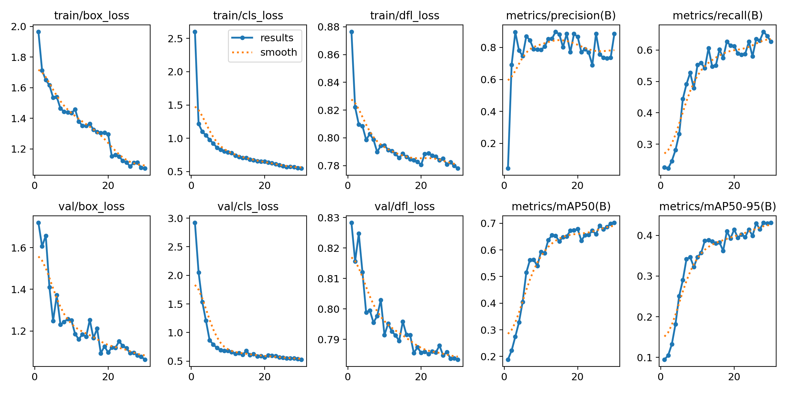

# YOLOv8 Football Players Detection

## 프로젝트 개요
YOLOv8 모델을 활용한 축구 경기 영상 내 객체 검출 프로젝트.
Pretrained 모델을 커스텀 데이터셋으로 Fine-tuning하여
선수, 골키퍼, 심판, 공을 검출합니다.

## 데이터셋
- 출처: Roboflow Universe (football-players-detection)
- 이미지: 372장
- 클래스(4): ball, player, referee, goalkeeper

## 학습 환경
- 모델: YOLOv8n (nano)
- 프레임워크: PyTorch + Ultralytics
- GPU: Google Colab T4
- Epochs: 30 | Batch: 16 | Image Size: 640px

## 학습 결과
| 지표 | 수치 |
|------|------|
| mAP50 | 70% |
| mAP50-95 | 40% |
| Precision | 85% |
| Recall | 65% |

## 학습 그래프

## 배운 점
- YOLOv8 pretrained → fine-tuning 전이학습 흐름
- 검출 평가지표 (mAP, Precision, Recall, IoU) 이해
- 커스텀 데이터셋 구성 (이미지 + 라벨 구조)
